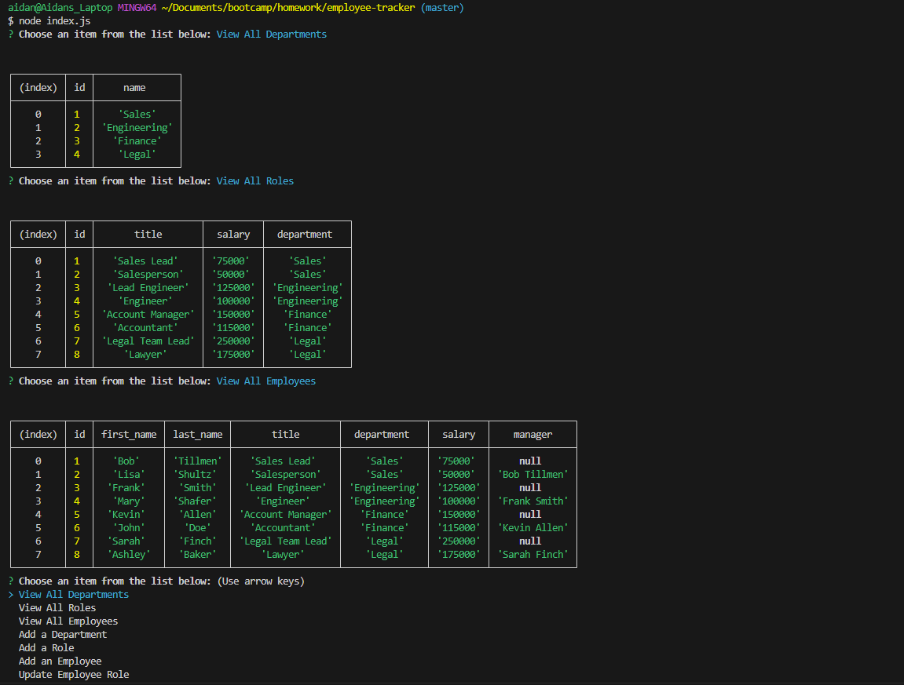

# Employee Tracker
The following is an employee tracking content management system (CMS) that is built utilizing MySQL databases, Inquirer and Node JS.

## Purpose of Assignment
 - The main focus of this assignment was working with MySQL to make an employee tracking database for a small buisness that was user friendly to non-developers.
 - The application runs in the command line, and users can see and manipulate employee data by scrolling through lists and selecting their desired outcome.
 - The User can see lists of all the departments, employee roles, and employees with the associated data that goes along with it.
 - The User can add a new department, a new employee role, or a new employee if changes are made at their workplace.
 - The User can also update an employee's role if it changes within the company.

## Instructions for the User
 - Please use app and comment on any errors.

## Screen Shot of Working Application

## Link to GitHub Repository
[Click Here to View GitHub Repo](https://github.com/Aidan-Windebank/employee-tracker)

## Link to Screencast Video to See Application in Use
[Click Here to View Video]()